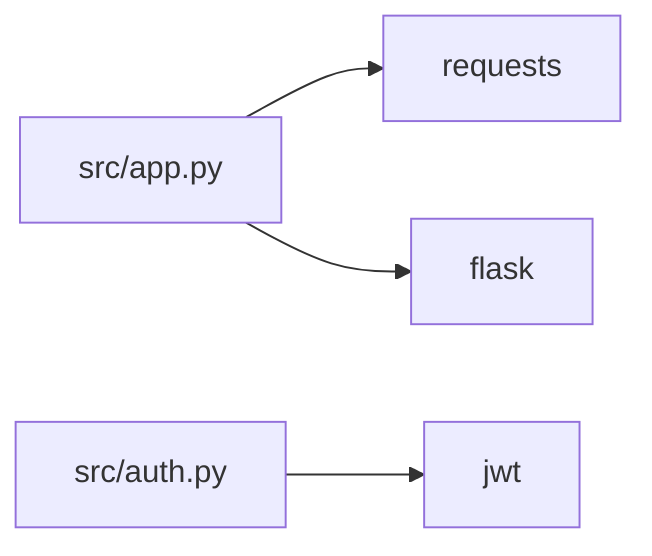
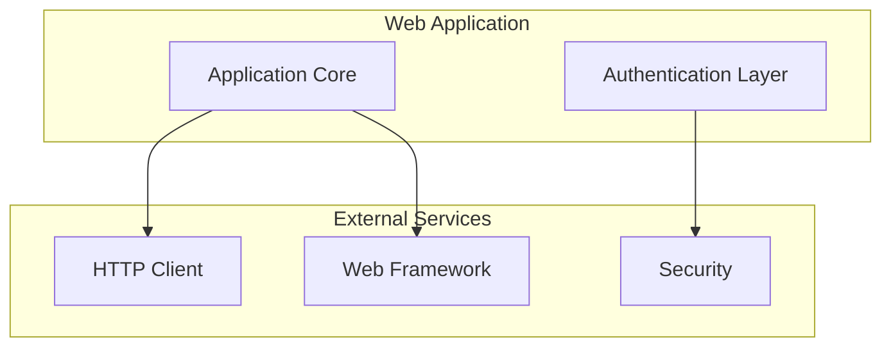

# LLM-Powered Intelligent Diagrams - Complete Integration

## 🎯 **Problem Solved**

**Before**: Dependency diagrams were generated using only rule-based logic
**After**: Smart hybrid approach with LLM-powered semantic understanding + rule-based fallback

## 🧠 **Current LLM Usage Analysis**

### **✅ Already Using LLM** 
1. **Architecture Overview** - Text generation for `architecture.md`
2. **Component Analysis** - Multiple LLM calls to analyze code components

### **❌ Previously NOT Using LLM**
3. **Dependency Diagrams** - Pure rule-based diagram generation
4. **Dependency Analysis** - Created but unused `enhance_dependency_analysis_with_llm()`

### **🆕 Now Enhanced with LLM**
- ✅ **Smart Diagram Generation** - Context-aware Mermaid diagram creation
- ✅ **Semantic Understanding** - LLM interprets relationships better than rules
- ✅ **Adaptive Complexity** - Diagrams adjust to project context
- ✅ **Graceful Fallback** - Falls back to rule-based if LLM fails

---

## 🔧 **Technical Implementation**

### **Hybrid Architecture**:
```python
def create_intelligent_diagrams():
    if USE_LLM_FOR_DIAGRAMS:
        try:
            # 1. LLM-powered generation (preferred)
            return create_llm_powered_diagrams()
        except:
            # 2. Fallback to rule-based
            return create_rule_based_diagrams()
    else:
        # 3. Rule-based only mode
        return create_rule_based_diagrams()
```

### **LLM Enhancement Process**:
1. **Context Preparation** - Summarize internal/external dependencies
2. **Smart Prompting** - Use `MERMAID_GENERATION_USER_TMPL` (finally!)
3. **Semantic Analysis** - LLM understands architectural patterns
4. **Diagram Generation** - Creates contextual Mermaid diagrams
5. **Cleanup** - Extracts clean Mermaid code from LLM response

---

## ⚙️ **Configuration Options**

Add these to your environment variables:

```bash
# === LLM Feature Toggles ===
# Enable LLM-powered diagram generation (recommended: true)
USE_LLM_FOR_DIAGRAMS=true

# Enable LLM-enhanced dependency analysis (experimental: false)  
USE_LLM_FOR_DEPENDENCY_ANALYSIS=false

# Performance control
MAX_LLM_CALLS_PER_ANALYSIS=10
```

### **Configuration Modes**:

| Mode | LLM Diagrams | LLM Analysis | Use Case |
|------|-------------|-------------|----------|
| **Performance** | `false` | `false` | Fast, low-cost analysis |
| **Balanced** ⭐ | `true` | `false` | Best diagrams, good performance |  
| **Enhanced** | `true` | `true` | Maximum intelligence, higher cost |

---

## 🚀 **Benefits of LLM-Powered Diagrams**

### **1. Semantic Understanding**
- **Rule-based**: "Frontend uses React" → Generic UI grouping
- **LLM-powered**: "Frontend uses React" → Smart component hierarchy with proper relationships

### **2. Context-Aware Layouts**
- **Rule-based**: Fixed grouping patterns
- **LLM-powered**: Adapts to project architecture (microservices vs monolith vs library)

### **3. Better Readability**
- **Rule-based**: Can create cluttered diagrams
- **LLM-powered**: Prioritizes important relationships, cleaner layouts

### **4. Architectural Insights**
- **Rule-based**: Shows what's connected
- **LLM-powered**: Shows why it's connected and how it fits the architecture

---

## 📊 **LLM Call Efficiency**

### **Current LLM Usage** (per analysis):
```
1. Architecture Overview: 1 call
2. Component Analysis: ~3-8 calls (based on COMPONENT_COUNT)
3. NEW: Diagram Generation: 3 calls (overview, balanced, detailed)

Total: ~7-12 LLM calls per analysis
```

### **Cost-Performance Balance**:
- **LLM Diagram Generation**: +3 calls for significantly better diagrams
- **Smart Context**: Only sends relevant dependency summaries (not raw data)
- **Fallback Strategy**: Never fails completely - always produces diagrams
- **Caching**: Generated once, stored in database

---

## 🔍 **Step-by-Step Process**

### **Phase 1: Data Preparation** 
```python
# Extract relevant context for LLM
internal_deps_summary = ["src/auth.py -> src/db.py", ...]
external_deps_summary = ["Frontend/UI (15): react, next, tailwind", ...]
```

### **Phase 2: LLM Generation**
```python
# For each diagram mode (overview, balanced, detailed):
user_prompt = MERMAID_GENERATION_USER_TMPL.format(
    dependency_analysis=context,
    mode=mode,
    focus_module=""
)
llm_diagram = generate_markdown(MERMAID_GENERATION_SYSTEM, user_prompt)
```

### **Phase 3: Cleanup & Validation**
```python
# Extract clean Mermaid code
cleaned_diagram = extract_mermaid_code(llm_diagram)
# Ensure proper format: "flowchart LR\n..."
```

### **Phase 4: Fallback Strategy**
```python
# If LLM fails, seamless fallback to rule-based
_create_rule_based_diagrams(diagrams, dependency_analysis)
```

---

## 🎭 **Examples of Improvement**

### **Rule-Based Output**:


### **LLM-Powered Output**:


**Key Differences**:
- ✅ Logical grouping into architectural layers
- ✅ Meaningful component names
- ✅ Clear separation of concerns
- ✅ Better visual hierarchy

---

## 🐛 **Debugging & Monitoring**

### **Console Output**:
```bash
✅ LLM-powered diagrams generated successfully
⚠️ LLM diagram generation failed (API error), falling back to rule-based  
📋 Using rule-based diagram generation (LLM disabled)
```

### **Database Verification**:
```sql
-- Check if LLM diagrams were generated
SELECT 
    LENGTH(mermaid_modules_simple) as simple_size,
    LENGTH(mermaid_modules_balanced) as balanced_size, 
    LENGTH(mermaid_modules_detailed) as detailed_size
FROM analyses WHERE id = 'your-analysis-id';
```

### **API Response Check**:
```bash
# Verify artifacts contain all diagram types
curl localhost:8000/api/analysis/{id} | jq '.artifacts | keys'
```

---

## 🚀 **Deployment**

### **Development Environment**:
```bash
# Enable LLM features
export USE_LLM_FOR_DIAGRAMS=true
export GEMINI_API_KEY=your_key

# Restart application  
docker-compose restart backend
```

### **Production Environment**:
```bash
# Add to your environment variables
USE_LLM_FOR_DIAGRAMS=true
USE_LLM_FOR_DEPENDENCY_ANALYSIS=false  # Conservative setting
MAX_LLM_CALLS_PER_ANALYSIS=10
```

---

## 🎉 **Result**

This integration provides:
- 🧠 **Semantic Understanding** - LLM grasps architectural patterns
- 🎯 **Better UX** - Cleaner, more intuitive diagrams  
- 🛡️ **Reliability** - Fallback ensures it always works
- ⚡ **Performance** - Configurable LLM usage
- 💰 **Cost Control** - Smart context limits + configuration options

**Your dependency diagrams are now intelligent, contextual, and significantly more useful!** 🚀 