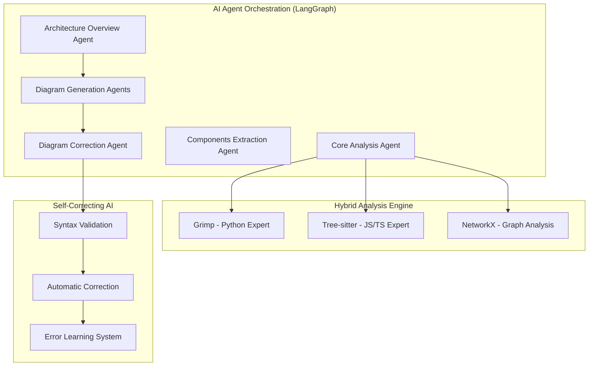
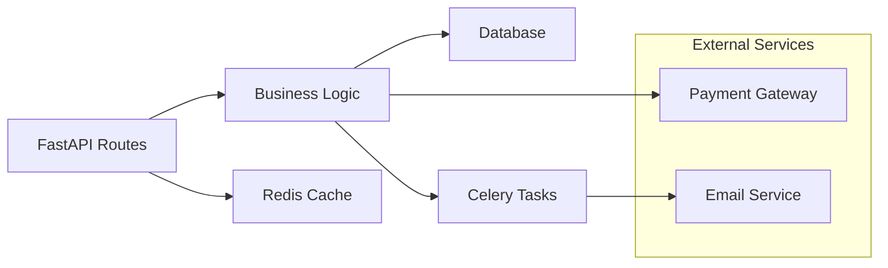

# Code Architecture Mapper (CAM)

> **Revolutionary AI-Powered Repository Analysis** - The future of automated code analysis is here.

[](https://cam.theshikhar.com)
[](./docs/README.md)

**Code Architecture Mapper** represents a groundbreaking leap in automated code analysis, combining cutting-edge **AI agent workflows** with sophisticated static analysis to create the most intelligent repository documentation system ever built.

## What Makes This Revolutionary

### Multi-Agent AI Architecture
- **LangGraph-powered workflows** with specialized AI agents working in concert
- **Self-correcting systems** that learn and adapt from errors  
- **Intelligent fallback strategies** ensuring analysis always succeeds

### Hybrid Analysis Engine
- **Grimp + Tree-sitter** for maximum accuracy across Python, JS, and TS
- **Advanced dependency resolution** with tsconfig.json and package detection
- **Graph theory metrics** revealing hidden architectural patterns

### Self-Correcting Diagram Generation
- **AI-generated Mermaid diagrams** that auto-fix syntax errors
- **Progressive enhancement** from rule-based to AI-powered generation
- **Multiple complexity modes** (Simple, Balanced, Detailed)

### Production-Ready Architecture
- **FastAPI + Next.js 15** with modern TypeScript and Python
- **PostgreSQL integration** with intelligent caching
- **Docker containerization** ready for any cloud platform

## Quick Start

### Try It Now (60 seconds)

   ```bash
# 1. Clone the repository
git clone https://github.com/yourusername/code-architecture-mapper.git
   cd code-architecture-mapper

# 2. Set up backend (requires Google Gemini API key)
   cd backend
   echo "GEMINI_API_KEY=your_gemini_api_key_here" > .env
   docker-compose up --build

# 3. Start frontend (new terminal)
cd ../frontend
npm install && npm run dev

# 4. Analyze your first repository!
# Visit http://localhost:3000
```

**Get your free Gemini API key**: [Google AI Studio](https://aistudio.google.com/api-keys)

### Cloud Deployment

**Frontend** → [Vercel](https://vercel.com) (Free)
   ```bash
cd frontend && vercel --prod
```

**Backend** → [Render](https://render.com) (Free tier available)
- Connect GitHub repo, set Root Directory to "backend"
- Add environment variables: GEMINI_API_KEY, DATABASE_URL
- Deploy automatically on push

## AI Agent Workflow Architecture

### The Revolutionary Multi-Agent System



### What Happens Under the Hood

1. **Static Analysis Phase** - Hybrid engine analyzes code with multiple parsers
2. **AI Enhancement Phase** - Multiple agents generate insights in parallel
3. **Creative Phase** - AI creates diagrams and documentation
4. **Self-Correction Phase** - System validates and fixes its own output
5. **Synthesis Phase** - All insights combined into comprehensive analysis

## Technical Innovation Highlights

### Hybrid Analysis Breakthrough
```python
# Combines best-in-class tools for maximum accuracy
def analyze_repository(repo_path):
    # Python: Grimp for package-aware analysis
    python_deps = grimp.build_graph(packages)
    
    # JS/TS: Tree-sitter with tsconfig.json support  
    ts_deps = tree_sitter.parse_with_config(files, tsconfig)
    
    # Graph: NetworkX for centrality metrics
    graph = nx.DiGraph()
    centrality = nx.degree_centrality(graph)
    
    # AI: LangGraph agents for intelligent insights
    insights = langgraph_workflow.invoke(analysis_state)
```

### Self-Correcting AI System
```python  
# Revolutionary error-correcting diagram generation
@langgraph_node
def diagram_correction_agent(state):
    while not is_valid(diagram) and attempts < max_attempts:
        # 1. Detect errors with precision validation
        errors = validate_mermaid_syntax(diagram)
        
        # 2. Apply rule-based fixes first
        diagram = apply_manual_corrections(diagram, errors)
        
        # 3. Use AI for complex corrections
        if still_has_errors(diagram):
            diagram = ai_correct_diagram(diagram, errors)
        
        attempts += 1
    
    return finalize_best_attempt(diagram)
```

## Screenshots & Examples

### Architecture Overview Generation
<details>
<summary>🔍 Click to see AI-generated architecture documentation</summary>

**Input**: Raw repository  
**Output**: Professional architecture overview

```markdown
# FastAPI E-commerce Platform Architecture

## Overview
This FastAPI-based e-commerce platform follows a clean architecture pattern with 
clear separation between API routes, business logic, and data persistence layers.

## Key Components

### API Layer (`/routes`)
- **Product Routes**: RESTful endpoints for product management
- **User Authentication**: JWT-based auth with role-based access control
- **Order Processing**: Async order workflow with payment integration

### Business Logic (`/services`) 
- **Product Service**: Inventory management and catalog operations
- **Payment Service**: Stripe integration with webhook handling
- **Notification Service**: Email and SMS notifications via Celery

### Data Layer (`/models`)
- **SQLAlchemy Models**: User, Product, Order, Payment entities
- **Database Migrations**: Alembic-managed schema evolution
- **Redis Caching**: Session storage and API response caching

## Notable Patterns
- **Dependency Injection**: FastAPI's built-in DI container
- **Async/Await**: Non-blocking I/O throughout the application
- **Event-Driven Architecture**: Celery tasks for background processing
```

</details>

### Self-Correcting Diagram Generation
<details>
<summary>See the AI fix its own diagram errors</summary>

**Before (AI Generated with Errors)**:
```mermaid
graph LR
    API[FastAPI Routes] --> Business Logic
    Business Logic --> Database
    # ERROR: Space in node ID causes parser failure
```

**After (Self-Corrected)**:


**Correction Log**:
- ✅ Added missing flowchart header
- ✅ Fixed node ID with space (`Business Logic` → `BL`)
- ✅ Enhanced with proper grouping and relationships
- ✅ Validated final syntax successfully

</details>

## Documentation & Learning

### Comprehensive Guides
- **[Architecture Overview](./docs/architecture/overview.md)** - System design deep dive
- **[AI Agent Workflows](./docs/architecture/langgraph-agents.md)** - LangGraph implementation  
- **[Analysis Engine](./docs/analysis/engine.md)** - Hybrid parsing techniques
- **[Diagram Generation](./docs/analysis/diagram-generation.md)** - Self-correcting AI system
- **[LLM Integration](./docs/analysis/llm-integration.md)** - Google Gemini implementation

### Key Features

#### Current Capabilities
- ✅ **Multi-Agent AI Orchestration** - LangGraph workflow engine
- ✅ **Self-Correcting Diagrams** - AI that fixes its own syntax errors
- ✅ **Hybrid Code Analysis** - Grimp + Tree-sitter + NetworkX
- ✅ **Real-time Progress** - Live updates during analysis
- ✅ **Production Deployment** - Docker + Cloud-ready
- ✅ **Interactive Visualizations** - Mermaid diagram rendering

#### Coming Soon
- **Multi-Language Support** - Go, Rust, Java, C#
- **Mobile Apps** - iOS/Android analysis on the go
- **CI/CD Integration** - GitHub Actions, GitLab CI
- **Analytics Dashboard** - Usage insights and metrics
- **Team Collaboration** - Shared analysis and comments

## Contributing

### We Welcome Contributors!

Whether you're a seasoned developer or just starting out, there are many ways to contribute:

**Bug Reports** - Help us improve reliability  
**Feature Requests** - Share your ideas for new capabilities  
**Documentation** - Improve guides and examples  
**Code Contributions** - Add features or fix issues  
**UI/UX Improvements** - Enhance the user experience  
**Testing** - Add test cases and improve coverage  

### Quick Contribution Guide

```bash
# 1. Fork the repository
# 2. Create a feature branch
git checkout -b feature/amazing-new-feature

# 3. Make your changes
# 4. Add tests
# 5. Commit with clear messages  
git commit -m "feat: add amazing new feature that does X"

# 6. Push and create pull request
git push origin feature/amazing-new-feature
```

**Recognition**: All contributors get recognition in our [Hall of Fame](./CONTRIBUTORS.md)

## License & Support

### MIT License
This project is open source and available under the [MIT License](./LICENSE).

### Getting Help

**Issues**: [GitHub Issues](https://github.com/shikhar1verma/code-architecture-mapper/issues)  
**Discussions**: [GitHub Discussions](https://github.com/shikhar1verma/code-architecture-mapper/discussions)  
**Email**: shikhar1verma@gmail.com  
**X**: [@shikhar1verma](https://x.com/shikhar1verma)  


## Technology Stack

### Backend Powerhouse
- **FastAPI 0.111.0** - Modern async web framework
- **LangGraph** - Microsoft's agent workflow framework  
- **Grimp & Tree-sitter** - Advanced code parsing
- **NetworkX 3.3** - Graph analysis algorithms
- **Google Gemini AI** - LLM integration with fallbacks
- **PostgreSQL** - Robust data persistence

### Frontend Excellence
- **Next.js 15** - React framework with App Router
- **TypeScript** - Type-safe development
- **Tailwind CSS** - Modern styling system
- **Mermaid.js** - Interactive diagram rendering
- **Lucide React** - Beautiful icon system

---

## Join the Revolution

**Code Architecture Mapper** isn't just a tool—it's the future of how developers understand and document software architecture. Join thousands of developers who are already experiencing the power of AI-driven code analysis.

### Get Started Now
```bash
git clone https://github.com/yourusername/code-architecture-mapper.git
cd code-architecture-mapper
# Follow the Quick Start guide above
```

### ⭐ Show Your Support
If this project helps you, please consider giving it a star! ⭐

**Together, we're building the future of intelligent software development tools.**

---

<div align="center">

**Built with ❤️ by developers, for developers**

[🚀 Get Started](https://github.com/shikhar1verma/code-architecture-mapper) | [📚 Documentation](./docs/README.md) | [🎬 Live Demo](https://cam.theshikhar.com)

</div> 