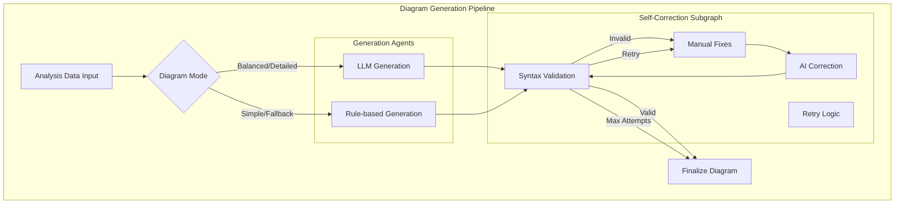
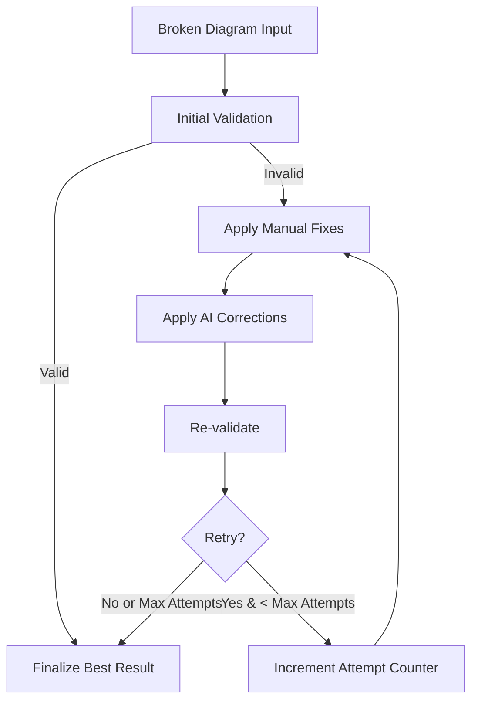
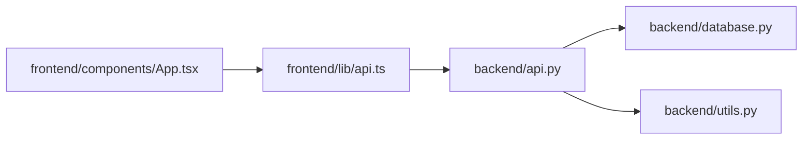
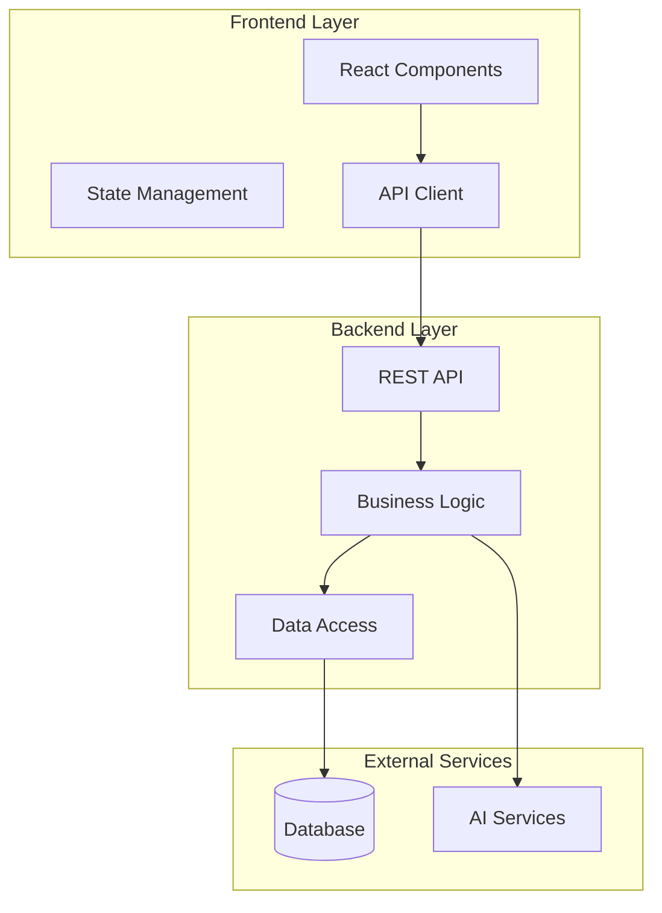

# Intelligent Diagram Generation

## Overview

Code Architecture Mapper features an advanced **AI-powered diagram generation system** that creates Mermaid diagrams with self-correction capabilities. The system uses LangGraph agents to generate, validate, and automatically fix diagram syntax errors.

## System Architecture



## Diagram Modes

### 1. Simple Mode
**Purpose**: Clean, high-level overview diagrams  
**Target Audience**: Stakeholders, documentation readers  
**Complexity**: Low (10-20 nodes, essential connections only)

**Features**:
- Focus on main architectural components
- Hide implementation details
- Clear, readable layouts
- Suitable for presentations

### 2. Balanced Mode (Default)
**Purpose**: Comprehensive yet readable diagrams  
**Target Audience**: Developers, architects  
**Complexity**: Medium (20-50 nodes, key relationships)

**Features**:
- Balance between detail and clarity  
- Include major components and their relationships
- Show important utilities and services
- Group related functionality

### 3. Detailed Mode
**Purpose**: Complete technical diagrams  
**Target Audience**: Development teams, code reviews  
**Complexity**: High (50+ nodes, all significant relationships)

**Features**:
- Include all significant files and dependencies
- Show fine-grained relationships
- Technical implementation details
- Comprehensive dependency mapping

## LLM-Powered Generation

### Generation Process

The AI diagram generation follows a structured approach:

1. **Context Preparation**: Select relevant files and relationships
2. **Prompt Engineering**: Create structured prompts with analysis context
3. **LLM Invocation**: Generate Mermaid code using Google Gemini
4. **Post-processing**: Clean and validate the generated output

### Prompt Engineering Strategy

```python
def generate_llm_diagram(self, dependency_analysis, json_graph, file_infos, mode, architecture_md=""):
    """Generate diagram using LLM with carefully crafted prompts"""
    
    # Build context from analysis data
    context = self._build_diagram_context(dependency_analysis, json_graph, file_infos, mode)
    
    # Mode-specific instructions
    mode_instructions = {
        "simple": "Create a clean, high-level overview with 10-20 main components",
        "balanced": "Show key components and relationships, 20-50 nodes",
        "detailed": "Include all significant files and dependencies comprehensively"
    }
    
    system_prompt = f"""
    You are an expert software architect creating Mermaid diagrams.
    
    REQUIREMENTS:
    - Use 'flowchart LR' or 'flowchart TD' as header
    - {mode_instructions[mode]}
    - Use meaningful node labels in square brackets
    - Group related components using subgraphs
    - Use descriptive edge labels for relationships
    
    CONTEXT:
    Architecture Overview: {architecture_md[:1000]}
    
    Top Files: {context['top_files']}
    Key Dependencies: {context['key_dependencies']}
    """
    
    user_prompt = f"Generate a {mode} Mermaid diagram showing the architecture and dependencies."
    
    return self.gemini.generate_mermaid_diagram(system_prompt, user_prompt)
```

### Context Selection Algorithm

The system intelligently selects the most relevant information for diagram generation:

```python
def _build_diagram_context(self, dependency_analysis, json_graph, file_infos, mode):
    """Build context for diagram generation based on mode"""
    
    # Get top files by centrality
    top_files = self._get_top_files_by_centrality(json_graph, mode)
    
    # Select key dependencies  
    key_deps = self._select_key_dependencies(dependency_analysis, mode)
    
    # Identify component groups
    component_groups = self._identify_component_groups(file_infos, top_files)
    
    return {
        "top_files": top_files,
        "key_dependencies": key_deps,
        "component_groups": component_groups,
        "complexity_limit": self._get_complexity_limit(mode)
    }

def _get_complexity_limit(self, mode):
    """Return appropriate complexity limits for each mode"""
    return {
        "simple": {"max_nodes": 20, "max_edges": 25},
        "balanced": {"max_nodes": 50, "max_edges": 75}, 
        "detailed": {"max_nodes": 100, "max_edges": 150}
    }[mode]
```

## Self-Correction System

### Validation Engine

The system includes a comprehensive validation engine that checks for common Mermaid syntax errors:

```python
def _parser_errors_python_only(diagram: str) -> List[str]:
    """Detect syntax errors without external Mermaid validator"""
    errors = []
    
    # Check for required header
    if not _has_header(diagram):
        errors.append("Missing diagram type declaration. Add 'flowchart LR' or 'graph TD'")
    
    # Check subgraph balance
    opens = sum(1 for l in diagram.splitlines() if l.strip().startswith("subgraph"))
    closes = sum(1 for l in diagram.splitlines() if l.strip() == "end")
    if opens != closes:
        errors.append(f"Unbalanced subgraph blocks. subgraph={opens}, end={closes}")
    
    # Check identifier syntax
    errors.extend(_identifier_errors(diagram))
    
    # Check for problematic patterns
    errors.extend(_subgraph_errors(diagram))
    errors.extend(_parentheses_errors(diagram))
    
    return errors
```

### Manual Correction Rules

Before using AI correction, the system applies rule-based fixes for common issues:

```python
def _apply_correction(diagram: str, error: str) -> str:
    """Apply rule-based corrections for common syntax errors"""
    
    # Fix missing header
    if "Missing diagram type" in error:
        if not diagram.strip().startswith(("graph", "flowchart")):
            diagram = "flowchart LR\n" + diagram
    
    # Fix unbalanced subgraphs
    elif "Unbalanced subgraph blocks" in error:
        opens = sum(1 for l in diagram.splitlines() if l.strip().startswith("subgraph"))
        closes = sum(1 for l in diagram.splitlines() if l.strip() == "end")
        if opens > closes:
            diagram = diagram.rstrip() + ("\nend" * (opens - closes))
    
    # Fix identifiers with spaces
    elif "contains a space" in error:
        diagram = re.sub(r'\b([A-Za-z_]+)\s+([A-Za-z][\w-]*)\b', 
                        lambda m: m.group(1).rstrip('_') + "_" + m.group(2), 
                        diagram)
    
    # Fix parentheses in node labels (causes "got 'PS'" errors)
    elif "got 'PS'" in error or "parentheses in node label" in error:
        diagram = re.sub(r'\b([A-Za-z_][\w-]*)\[([^"\]]*\([^"\]]*\)[^"\]]*)\]',
                        r'\1["\2"]', diagram)
    
    return diagram
```

### AI Correction Agent

For complex syntax errors that can't be fixed with rules, the system uses an AI correction agent:

```python
def llm_correction_node(state: CorrectionState) -> CorrectionState:
    """Use LLM for intelligent diagram correction"""
    
    if state["is_valid"]:
        return state  # Already valid
    
    try:
        correction_prompt = f"""
        Fix the following Mermaid diagram syntax errors:
        
        ERRORS:
        {chr(10).join(state["validation_errors"])}
        
        DIAGRAM:
        {state["raw_diagram"]}
        
        REQUIREMENTS:
        - Fix ONLY the syntax errors listed above
        - Preserve the logical structure and content
        - Return only the corrected Mermaid code
        - Use proper flowchart syntax
        """
        
        corrected = content_service.correct_llm_diagram(correction_prompt)
        state["raw_diagram"] = corrected
        state["llm_correction_applied"] = True
        
    except Exception as e:
        logger.warning(f"LLM correction failed: {e}")
        state["llm_correction_applied"] = False
    
    return state
```

### Correction Workflow

The correction process follows a sophisticated retry loop:



## Rule-Based Generation

For fallback scenarios or when LLM generation fails, the system includes rule-based diagram generators:

### Module Dependency Diagrams

```python
def modules_mermaid(edges: List[Dict]) -> str:
    """Generate basic module dependency diagram from edges"""
    
    lines = ["flowchart LR"]
    
    # Add nodes for all source and destination files
    nodes = set()
    for edge in edges:
        if edge.get("internal", True):  # Only internal edges
            nodes.add(edge["src"])
            nodes.add(edge["dst"])
    
    # Create node declarations with clean labels
    for node in sorted(nodes):
        label = _clean_node_label(node)
        node_id = _create_node_id(node)
        lines.append(f"    {node_id}[{label}]")
    
    # Add edges
    for edge in edges:
        if edge.get("internal", True):
            src_id = _create_node_id(edge["src"])
            dst_id = _create_node_id(edge["dst"])
            lines.append(f"    {src_id} --> {dst_id}")
    
    return "\n".join(lines)
```

### Folder Structure Diagrams

```python
def folders_mermaid(file_paths: List[str]) -> str:
    """Generate folder structure diagram"""
    
    lines = ["flowchart TD"]
    
    # Build folder hierarchy
    folders = _build_folder_tree(file_paths)
    
    # Generate folder nodes and structure
    for folder_path, children in folders.items():
        folder_id = _path_to_id(folder_path)
        folder_label = os.path.basename(folder_path) or "Root"
        
        lines.append(f"    {folder_id}[{folder_label}/]")
        
        # Connect to parent folder
        parent = os.path.dirname(folder_path)
        if parent and parent in folders:
            parent_id = _path_to_id(parent)
            lines.append(f"    {parent_id} --> {folder_id}")
    
    return "\n".join(lines)
```

## Diagram Types Generated

### 1. Module Dependency Diagrams (`mermaid_modules_*`)
Shows file-to-file dependencies within the repository.

**Example Output**:


### 2. Folder Structure Diagrams (`mermaid_folders`)
Shows the hierarchical organization of the codebase.

**Example Output**:
```mermaid
flowchart TD
    Root[/] --> Backend[backend/]
    Root --> Frontend[frontend/]
    Backend --> Services[services/]
    Backend --> Routes[routes/]
    Frontend --> Components[components/]
    Frontend --> Lib[lib/]
```

### 3. Architecture Overview Diagrams
High-level system architecture showing major components and their relationships.

**Example Output**:


## Performance Optimization

### Caching Strategy

```python
class DiagramCache:
    """Cache generated diagrams to avoid regeneration"""
    
    def __init__(self):
        self.cache = {}
    
    def get_cached_diagram(self, cache_key: str) -> Optional[str]:
        """Get cached diagram if available and valid"""
        if cache_key in self.cache:
            cached_item = self.cache[cache_key]
            if self._is_cache_valid(cached_item):
                return cached_item["diagram"]
        return None
    
    def cache_diagram(self, cache_key: str, diagram: str, metadata: Dict):
        """Cache a successfully generated diagram"""
        self.cache[cache_key] = {
            "diagram": diagram,
            "generated_at": datetime.utcnow(),
            "metadata": metadata
        }
    
    def _create_cache_key(self, dependency_analysis: Dict, mode: str) -> str:
        """Create cache key based on analysis content and mode"""
        content_hash = hashlib.md5(
            json.dumps(dependency_analysis, sort_keys=True).encode()
        ).hexdigest()
        return f"{mode}_{content_hash[:12]}"
```

### Complexity Management

```python
def _manage_diagram_complexity(self, nodes: List, edges: List, mode: str) -> Tuple[List, List]:
    """Reduce diagram complexity based on mode limits"""
    
    limits = self._get_complexity_limit(mode)
    
    # Prioritize nodes by centrality
    if len(nodes) > limits["max_nodes"]:
        nodes = self._select_top_nodes_by_importance(nodes, limits["max_nodes"])
    
    # Filter edges to only include nodes we kept
    valid_node_ids = {node["id"] for node in nodes}
    filtered_edges = [
        edge for edge in edges 
        if edge["source"] in valid_node_ids and edge["target"] in valid_node_ids
    ]
    
    # If still too many edges, prioritize by importance
    if len(filtered_edges) > limits["max_edges"]:
        filtered_edges = self._select_top_edges_by_importance(
            filtered_edges, limits["max_edges"]
        )
    
    return nodes, filtered_edges
```

## Configuration

Diagram generation behavior can be customized:

```python
# Diagram generation settings
USE_LLM_FOR_DIAGRAMS = True          # Enable AI diagram generation
MAX_DIAGRAM_ATTEMPTS = 3             # Correction retry limit
DIAGRAM_GENERATION_TIMEOUT = 120     # Max generation time (seconds)

# Complexity limits per mode
DIAGRAM_COMPLEXITY_LIMITS = {
    "simple": {"max_nodes": 20, "max_edges": 25},
    "balanced": {"max_nodes": 50, "max_edges": 75},
    "detailed": {"max_nodes": 100, "max_edges": 150}
}

# Validation settings  
ENABLE_STRICT_VALIDATION = True      # Strict syntax checking
ALLOW_WARNINGS_AS_ERRORS = False     # Treat warnings as errors
```

## Error Handling and Fallbacks

### Comprehensive Error Recovery

```python
def generate_diagram_with_fallbacks(self, analysis_data, mode):
    """Generate diagram with multiple fallback strategies"""
    
    try:
        # Primary: LLM generation with self-correction
        if USE_LLM_FOR_DIAGRAMS:
            return self._generate_with_llm_correction(analysis_data, mode)
            
    except GeminiQuotaExhaustedError:
        logger.warning("LLM quota exhausted, falling back to rule-based")
        
    except GeminiAPIError as e:
        logger.warning(f"LLM API error: {e}, falling back to rule-based")
    
    try:
        # Fallback 1: Rule-based generation
        return self._generate_rule_based_diagram(analysis_data, mode)
        
    except Exception as e:
        logger.error(f"Rule-based generation failed: {e}")
    
    # Fallback 2: Basic template
    return self._generate_basic_template_diagram(analysis_data)

def _generate_basic_template_diagram(self, analysis_data):
    """Last resort: generate a basic template diagram"""
    return """flowchart LR
    A[Repository Analysis] --> B[Architecture Overview]
    B --> C[Component Analysis]
    B --> D[Dependency Analysis]
    C --> E[Final Report]
    D --> E"""
```

## Integration with Frontend

### Real-time Rendering

The frontend uses Mermaid.js to render diagrams with error handling:

```typescript
// MermaidDiagram.tsx
const renderDiagram = async (diagramCode: string) => {
  try {
    // Validate diagram before rendering
    const isValid = await mermaid.parse(diagramCode);
    if (!isValid) {
      throw new Error('Invalid Mermaid syntax');
    }
    
    // Render with error recovery
    const { svg } = await mermaid.render('diagram-id', diagramCode);
    setDiagramSvg(svg);
    setError(null);
    
  } catch (renderError) {
    console.error('Diagram rendering failed:', renderError);
    
    // Request server-side correction
    const correctedDiagram = await requestDiagramCorrection(
      diagramCode, 
      renderError.message
    );
    
    if (correctedDiagram !== diagramCode) {
      // Retry with corrected version
      renderDiagram(correctedDiagram);
    } else {
      // Show error state
      setError('Unable to render diagram');
    }
  }
};
```

### Progressive Enhancement

Diagrams are generated progressively:

1. **Initial Load**: Show basic rule-based diagram immediately
2. **AI Enhancement**: Replace with AI-generated diagram when ready
3. **Error Recovery**: Fall back to working version if AI generation fails
4. **User Feedback**: Allow users to regenerate or request specific modes

## Future Enhancements

### Advanced Diagram Types

**Planned Features**:
- **Sequence Diagrams**: Show interaction flows between components
- **Class Diagrams**: Object-oriented relationship visualization  
- **Entity Relationship Diagrams**: Database schema visualization
- **Timeline Diagrams**: Development history and evolution

### Interactive Diagrams

**Roadmap**:
- **Clickable Nodes**: Navigate to source code
- **Expandable Sections**: Show/hide detail levels dynamically
- **Filter Controls**: Focus on specific components or relationships
- **Real-time Updates**: Live diagram updates during code changes

### AI Enhancements

**Future AI Capabilities**:
- **Style Learning**: Learn preferred diagram styles from user feedback
- **Context Awareness**: Better understanding of domain-specific patterns
- **Multi-Modal Input**: Incorporate documentation and comments for better context
- **Collaborative Filtering**: Learn from successful diagrams across projects

---

*The intelligent diagram generation system represents a significant advancement in automated documentation, combining the reliability of rule-based generation with the intelligence and adaptability of modern AI systems.*
