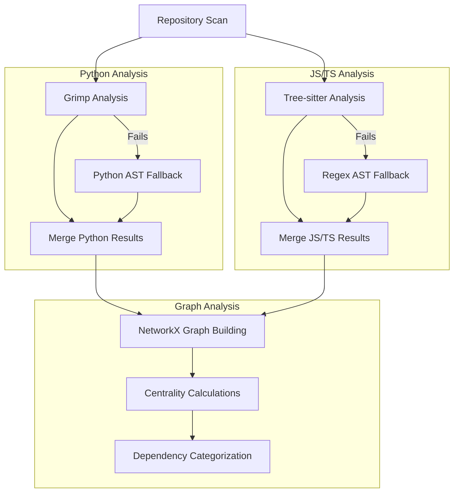

# Code Analysis Engine

## Overview

The Code Analysis Engine is the foundation of CAM's capabilities, providing hybrid static analysis that combines multiple parsing techniques for maximum accuracy and coverage. It supports Python, JavaScript, TypeScript, JSX, and TSX codebases.

## Hybrid Analysis Approach

### Philosophy

Rather than relying on a single analysis tool, CAM uses a **hybrid approach** that leverages the strengths of different tools:

- **Precision Tools**: Use the most accurate tool available for each language
- **Fallback Strategy**: When precision tools fail, fall back to simpler but more reliable methods
- **Result Fusion**: Combine results from multiple analysis methods for comprehensive coverage
- **Graceful Degradation**: Continue analysis even when some tools fail

### Analysis Pipeline



## Language-Specific Analysis

### Python Analysis

**Primary Tool**: [Grimp](https://github.com/seddonym/grimp)
**Fallback**: AST (Abstract Syntax Tree) parsing

#### Grimp Analysis Advantages
- **Package-Aware**: Understands Python package structure
- **Import Resolution**: Accurate resolution of relative and absolute imports
- **Dependency Graph**: Built-in graph construction with external package handling
- **Module Discovery**: Automatic detection of Python packages in repository

#### Implementation Details

```python
def py_edges_grimp(self) -> List[Dict[str, Any]]:
    """Build edges using Grimp for enhanced Python analysis"""
    try:
        packages = self.detect_python_packages()
        
        for pkg in packages:
            # Build graph with external package tracking
            graph = grimp.build_graph(pkg, include_external_packages=True)
            
            # Map modules to file paths
            mod_to_file = self._map_modules_to_files(graph.modules)
            
            # Extract dependencies
            for importer in graph.modules:
                for imported in graph.find_modules_directly_imported_by(importer):
                    src = mod_to_file.get(importer)
                    dst = mod_to_file.get(imported)
                    
                    if src and dst:
                        # Internal dependency
                        edges.append(self._edge(src, dst, True, "grimp"))
                    elif src and not dst:
                        # External dependency
                        edges.append(self._edge(src, imported, False, "grimp-ext"))
```

#### AST Fallback Strategy

When Grimp fails (missing dependencies, syntax errors, etc.), the system falls back to AST parsing:

```python
def py_imports_ast(self, file_path: str, code: str) -> List[Dict[str, Any]]:
    """Extract Python imports using AST parsing (fallback)"""
    try:
        tree = ast.parse(code)
        
        for node in ast.walk(tree):
            if isinstance(node, ast.Import):
                # Handle 'import module' statements
                for alias in node.names:
                    mod = alias.name
                    dst_rel = self.resolve_python_import_ast(file_path, mod, level=0)
                    edges.append(self._edge(file_path, dst_rel or mod, bool(dst_rel), "py-import"))
                    
            elif isinstance(node, ast.ImportFrom):
                # Handle 'from module import ...' statements  
                mod = node.module or ""
                dst_rel = self.resolve_python_import_ast(file_path, mod, level=node.level or 0)
                edges.append(self._edge(file_path, dst_rel or mod, bool(dst_rel), "py-from"))
```

### JavaScript/TypeScript Analysis

**Primary Tool**: [Tree-sitter](https://tree-sitter.github.io/tree-sitter/)
**Fallback**: Regex-based AST parsing

#### Tree-sitter Analysis Advantages
- **Language Grammar**: Uses official language grammars for accurate parsing
- **Query System**: Powerful query language for extracting specific syntax patterns
- **Error Recovery**: Handles partial/broken code gracefully
- **Performance**: Fast parsing suitable for large codebases

#### TypeScript Configuration Support

Full support for `tsconfig.json` path mapping:

```python
def resolve_ts_import(self, spec: str, src_file: str, tsconf: Dict[str, Any]) -> Optional[str]:
    """Resolve TS import to repo relative path if internal"""
    
    # Handle relative imports
    if spec.startswith(".") or spec.startswith("/"):
        return self._normalize_rel(spec, src_file)
    
    # Handle tsconfig path mapping
    co = tsconf.get("compilerOptions", {})
    base_url = co.get("baseUrl", "")  
    paths = co.get("paths", {})
    
    # Exact alias matching
    if spec in paths:
        for repl in paths[spec]:
            candidate = self._resolve_path_candidate(base_url, repl)
            if candidate:
                return candidate
    
    # Wildcard pattern matching
    for pattern, replacements in paths.items():
        if "*" in pattern:
            if self._matches_pattern(spec, pattern):
                candidate = self._resolve_wildcard_path(spec, pattern, replacements, base_url)
                if candidate:
                    return candidate
    
    return None  # External dependency
```

#### Tree-sitter Query Implementation

```python
def js_ts_imports_treesitter(self, file_path: str, code: str, tsconf: Dict[str, Any]):
    """Extract JS/TS imports using tree-sitter"""
    
    lang = "typescript" if file_path.endswith((".ts", ".tsx")) else "javascript"
    parser = get_parser(lang)
    language = get_language(lang)
    
    tree = parser.parse(code.encode("utf-8"))
    
    # Query for import/export statements and dynamic imports
    query_str = """
      (import_statement source: (string) @spec)
      (export_statement source: (string) @spec)
      (call_expression
         function: (identifier) @fn
         arguments: (arguments (string) @spec))
      (call_expression  
         function: (import)
         arguments: (arguments (string) @spec))
    """
    
    query = language.query(query_str)
    captures = query.captures(tree.root_node)
    
    for node, capture_name in captures:
        if capture_name == "spec":
            import_spec = node.text.decode("utf-8").strip('"\'')
            resolved_path = self.resolve_ts_import(import_spec, file_path, tsconf)
            edges.append(self._edge(file_path, resolved_path or import_spec, 
                                   bool(resolved_path), "tree-sitter"))
```

## Graph Analysis and Metrics

### NetworkX Integration

CAM uses NetworkX to build directed graphs representing code dependencies and calculate meaningful metrics:

```python
def build_graph(self, file_infos: List[Dict], edges: List[Dict]) -> Tuple[nx.DiGraph, Dict]:
    """Build NetworkX graph and calculate metrics"""
    
    G = nx.DiGraph()
    internal_files = {fi["path"] for fi in file_infos}
    
    # Add nodes with metadata
    for f in internal_files:
        G.add_node(f, 
                  language=lang_by_file[f], 
                  loc=loc_by_file[f])
    
    # Add edges for internal dependencies only
    for e in edges:
        if e["internal"] and e["dst"] in internal_files:
            G.add_edge(e["src"], e["dst"], via=e["via"])
    
    # Calculate centrality metrics
    fan_out = {n: G.out_degree(n) for n in G.nodes}
    fan_in = {n: G.in_degree(n) for n in G.nodes}
    in_centrality = nx.in_degree_centrality(G)
    out_centrality = nx.out_degree_centrality(G)  
    degree_centrality = nx.degree_centrality(G)
    
    return G, {
        "graph_metrics": {
            "fan_in": fan_in,
            "fan_out": fan_out, 
            "in_degree_centrality": in_centrality,
            "out_degree_centrality": out_centrality,
            "degree_centrality": degree_centrality,
            "top_files": sorted(G.nodes, key=lambda n: fan_in[n] + fan_out[n], reverse=True)[:100]
        },
        "json_graph": self._create_json_graph(G)
    }
```

### Centrality Metrics

CAM calculates multiple centrality measures to identify important files:

#### Fan-In (Import Count)
- **Definition**: Number of files that import this file
- **Significance**: High fan-in indicates widely-used/central files
- **Use Cases**: Identify core libraries, utilities, shared components

#### Fan-Out (Dependency Count)  
- **Definition**: Number of files this file imports
- **Significance**: High fan-out may indicate complex/coupled files
- **Use Cases**: Identify potential refactoring candidates

#### Degree Centrality
- **Definition**: Normalized measure combining fan-in and fan-out
- **Significance**: Overall importance in the dependency graph
- **Use Cases**: Prioritize files for documentation, testing, refactoring

#### In-Degree Centrality
- **Definition**: Normalized fan-in relative to total possible connections
- **Significance**: Relative importance as a dependency target
- **Use Cases**: Identify the most critical shared components

#### Out-Degree Centrality
- **Definition**: Normalized fan-out relative to total possible connections
- **Significance**: Relative coupling/complexity measure
- **Use Cases**: Identify highly coupled files that may need attention

### Dependency Categorization

External dependencies are automatically categorized for better organization:

```python
def _categorize_external_dependency(self, dependency: str) -> str:
    """Categorize external dependencies for better organization"""
    
    # Framework detection
    if any(fw in dependency.lower() for fw in ['react', 'vue', 'angular', 'svelte']):
        return "Frontend Frameworks"
        
    # Web framework detection
    elif any(web in dependency.lower() for web in ['express', 'fastapi', 'flask', 'django']):
        return "Web Frameworks"
        
    # Database detection
    elif any(db in dependency.lower() for db in ['postgres', 'mysql', 'mongodb', 'redis']):
        return "Databases"
        
    # Testing tools
    elif any(test in dependency.lower() for test in ['jest', 'pytest', 'mocha', 'cypress']):
        return "Testing"
        
    # Build tools
    elif any(build in dependency.lower() for build in ['webpack', 'vite', 'rollup', 'babel']):
        return "Build Tools"
        
    # UI libraries
    elif any(ui in dependency.lower() for ui in ['tailwind', 'bootstrap', 'material']):
        return "UI Libraries"
        
    # Type definitions
    elif dependency.startswith('@types/'):
        return "Type Definitions"
        
    # Scoped packages
    elif dependency.startswith('@'):
        return "Scoped Packages"
        
    else:
        return "External Libraries"
```

## Performance Optimizations

### File Filtering

Only supported file types are processed:

```python
SUPPORTED_EXTS = {".py", ".js", ".jsx", ".ts", ".tsx"}

def scan_repo(self) -> List[Dict[str, Any]]:
    """Scan repository for supported files"""
    files = []
    
    for root, _, names in os.walk(self.repo_root):
        for name in names:
            ext = os.path.splitext(name)[1].lower()
            if ext not in SUPPORTED_EXTS:
                continue
                
            # Process file...
```

### Memory Management

- **Streaming Processing**: Files processed individually, not loaded entirely into memory
- **Temporary Cleanup**: Repository clones cleaned up after analysis
- **Efficient Data Structures**: Use sets and dictionaries for fast lookups

### Error Recovery

Comprehensive error handling ensures analysis continues even when individual components fail:

```python
def py_edges_hybrid(self, files: List[Dict]) -> List[Dict]:
    """Hybrid Python analysis with error recovery"""
    
    print("🔍 Running hybrid Python analysis (Grimp + AST)...")
    
    # Try Grimp first
    grimp_edges = []
    try:
        grimp_edges = self.py_edges_grimp()
        print(f"   Grimp edges: {len(grimp_edges)}")
    except Exception as e:
        print(f"⚠️ Grimp analysis failed: {e}, falling back to AST")
    
    # Always run AST as backup
    ast_edges = []
    try:
        ast_edges = self.py_edges_ast_all_files(files)  
        print(f"   AST edges: {len(ast_edges)}")
    except Exception as e:
        print(f"⚠️ AST analysis also failed: {e}")
    
    # Merge results with Grimp taking precedence
    merged_edges = self._merge_edge_results(grimp_edges, ast_edges)
    
    print(f"   Final edges: {len(merged_edges)}")
    return merged_edges
```

## Output Format

The analysis engine produces comprehensive results:

```python
{
    "repository": {
        "root_path": "/tmp/repo-clone-12345",
        "url": "https://github.com/user/repo",
        "commit_sha": "abc123..."
    },
    "files": {
        "file_infos": [
            {
                "path": "src/components/Button.tsx",
                "ext": ".tsx", 
                "language": "tsx",
                "loc": 45,
                "content": "..."
            }
        ],
        "repository_metrics": {
            "file_count": 127,
            "loc_total": 15420,
            "language_stats": {
                "typescript": 65.2,
                "python": 28.1,
                "javascript": 6.7
            }
        }
    },
    "dependencies": {
        "edges": [
            {
                "src": "src/components/Button.tsx",
                "dst": "src/utils/styles.ts", 
                "internal": true,
                "via": "tree-sitter"
            }
        ],
        "dependency_analysis": {
            "total_edges": 234,
            "internal_count": 156, 
            "external_count": 78,
            "edge_types": {
                "grimp": 45,
                "tree-sitter": 89,
                "ast-regex": 22
            },
            "external_groups": {
                "Frontend Frameworks": [...],
                "UI Libraries": [...],
                "Build Tools": [...]
            }
        }
    },
    "metrics": {
        "graph_metrics": {
            "fan_in": {"file1": 5, "file2": 3},
            "fan_out": {"file1": 2, "file2": 7}, 
            "top_files": ["file1", "file2", ...]
        },
        "json_graph": {
            "nodes": [...],
            "edges": [...]
        }
    }
}
```

## Configuration

Analysis behavior can be configured via environment variables:

```python
# File processing limits
TOP_FILES = 40                    # Files to include in LLM processing
CHUNK_SIZE_CHARS = 1400          # Max characters per code excerpt

# Analysis toggles
USE_GRIMP_FOR_PYTHON = True      # Enable Grimp analysis
USE_TREE_SITTER_FOR_JS = True    # Enable Tree-sitter analysis  
INCLUDE_EXTERNAL_DEPS = True     # Track external dependencies

# Performance settings
MAX_FILE_SIZE_MB = 10            # Skip files larger than this
ANALYSIS_TIMEOUT_SECONDS = 300   # Max time for analysis phase
```

## Future Enhancements

### Planned Language Support
- **Go**: Using go/parser for accurate module analysis
- **Rust**: Using syn crate integration for Rust analysis
- **Java**: Using JavaParser for enterprise Java codebases
- **C#**: Using Roslyn analyzers for .NET projects

### Advanced Analysis Features
- **Call Graph Analysis**: Track function call relationships
- **Data Flow Analysis**: Identify data dependencies beyond imports
- **Cyclic Dependency Detection**: Find and report circular dependencies
- **Architecture Violation Detection**: Enforce layering rules

### Performance Improvements
- **Incremental Analysis**: Only analyze changed files
- **Parallel Processing**: Multi-threaded file processing
- **Caching**: Cache analysis results per file/commit
- **Streaming**: Process large repositories in chunks

---

*The hybrid analysis engine provides the foundation for accurate, comprehensive code architecture analysis across multiple languages and paradigms.*
