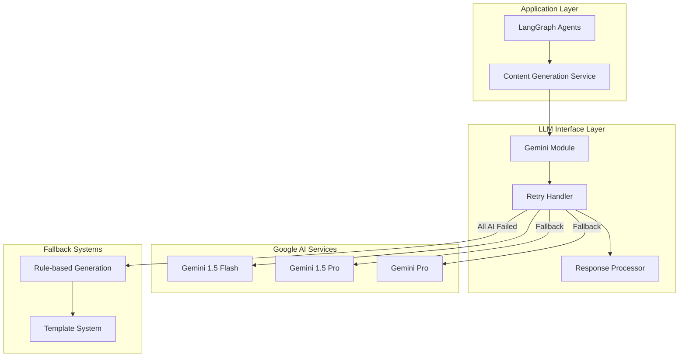

# LLM Integration

## Overview

Code Architecture Mapper integrates **Google Gemini** as its primary AI engine, providing intelligent analysis capabilities that go beyond static code parsing. The LLM integration is designed with robust error handling, quota management, and fallback strategies to ensure reliable operation.

## Architecture



## Core LLM Interface

### Clean API Design

The LLM interface provides three main functions with consistent error handling:

```python
# backend/llm/gemini.py

def generate_markdown(system_prompt: str, user_prompt: str) -> str:
    """Generate markdown content using Gemini with fallback models"""
    try:
        combined_prompt = f"{system_prompt}\n\n{user_prompt}"
        response = _retry_handler.call_with_fallback(combined_prompt)
        return ResponseProcessor.clean_markdown_response(response)
        
    except GeminiQuotaExhaustedError:
        raise  # Re-raise quota errors for special handling
    except Exception as e:
        logger.error(f"❌ Unexpected error in generate_markdown: {e}")
        raise GeminiAPIError(f"Unexpected API error: {str(e)}")

def generate_json(system_prompt: str, user_prompt: str, schema: Type[BaseModel]) -> Any:
    """Generate JSON content with Pydantic validation"""
    # Detailed implementation with retry logic for format correction

def generate_mermaid_correction(system_prompt: str, user_prompt: str) -> str:
    """Generate corrected Mermaid diagram code"""
    # Specialized for diagram syntax correction
```

### Multi-Model Fallback System

The retry handler implements intelligent fallback across multiple Gemini models:

```python
# backend/llm/retry_handler.py

class RetryHandler:
    def __init__(self):
        self.models = [
            "gemini-1.5-flash",      # Primary: Fast, cost-effective
            "gemini-1.5-pro",       # Fallback: More capable, slower
            "gemini-pro"            # Final fallback: Original model
        ]
        self.current_model_index = 0

    def call_with_fallback(self, prompt: str) -> str:
        """Try multiple models with exponential backoff"""
        
        for attempt in range(len(self.models)):
            model = self.models[self.current_model_index]
            
            try:
                response = self._make_api_call(model, prompt)
                # Success - reset to primary model for future calls
                self.current_model_index = 0
                return response
                
            except GeminiQuotaExhaustedError:
                logger.warning(f"Quota exhausted for {model}")
                self._advance_to_next_model()
                if self.current_model_index == 0:
                    # Cycled through all models
                    raise GeminiQuotaExhaustedError("All model quotas exhausted")
                continue
                
            except GeminiAPIError as e:
                if "429" in str(e) or "quota" in str(e).lower():
                    # Rate limit - try next model
                    self._advance_to_next_model()
                    continue
                else:
                    # Other API error - exponential backoff then retry
                    await asyncio.sleep(2 ** attempt)
                    continue
                    
        raise GeminiAPIError("All models failed after retries")
```

## Response Processing

### Markdown Response Cleaning

```python
# backend/llm/response_utils.py

class ResponseProcessor:
    @staticmethod
    def clean_markdown_response(response: str) -> str:
        """Clean and normalize markdown responses from LLM"""
        
        # Remove common LLM artifacts
        cleaned = response.strip()
        
        # Remove markdown code block wrappers if present
        if cleaned.startswith('```markdown\n'):
            cleaned = cleaned[12:]  # Remove ```markdown\n
        if cleaned.endswith('\n```'):
            cleaned = cleaned[:-4]   # Remove \n```
        
        # Remove leading/trailing whitespace
        cleaned = cleaned.strip()
        
        # Ensure proper markdown formatting
        cleaned = ResponseProcessor._normalize_headers(cleaned)
        cleaned = ResponseProcessor._fix_list_formatting(cleaned)
        
        return cleaned

    @staticmethod
    def extract_json(response: str) -> Dict[str, Any]:
        """Extract and parse JSON from LLM response"""
        
        # Try to find JSON block first
        json_match = re.search(r'```json\n(.*?)\n```', response, re.DOTALL)
        if json_match:
            json_str = json_match.group(1)
        else:
            # Look for JSON-like content
            json_str = ResponseProcessor._extract_json_content(response)
        
        try:
            return json.loads(json_str)
        except json.JSONDecodeError as e:
            raise ValueError(f"Invalid JSON in LLM response: {e}")
```

### Mermaid Code Extraction

```python
@staticmethod
def extract_mermaid_code(response: str) -> str:
    """Extract Mermaid diagram code from LLM response"""
    
    # Try different extraction patterns
    patterns = [
        r'```mermaid\n(.*?)\n```',      # Standard mermaid block
        r'```\n(flowchart.*?)\n```',    # Generic code block with flowchart
        r'```\n(graph.*?)\n```',        # Generic code block with graph
        r'(flowchart\s+\w+.*?)(?=\n\n|\n[A-Z]|\Z)',  # Raw flowchart content
        r'(graph\s+\w+.*?)(?=\n\n|\n[A-Z]|\Z)'       # Raw graph content
    ]
    
    for pattern in patterns:
        match = re.search(pattern, response, re.DOTALL | re.IGNORECASE)
        if match:
            diagram_code = match.group(1).strip()
            
            # Basic validation - ensure it looks like Mermaid
            if ResponseProcessor._is_valid_mermaid_structure(diagram_code):
                return diagram_code
    
    # Fallback: return original response cleaned up
    return ResponseProcessor._clean_potential_mermaid(response)
```

## Content Generation Services

### Architecture Overview Generation

```python
# backend/services/content_generation.py

class ContentGenerationService:
    def generate_architecture_overview(self, language_stats: Dict[str, float], 
                                     top_files: List[str], 
                                     excerpts: List[Tuple[str, str]]) -> str:
        """Generate comprehensive architecture documentation"""
        
        system_prompt = """
        You are an expert software architect analyzing a codebase.
        
        TASK: Generate a comprehensive architecture overview in markdown format.
        
        REQUIREMENTS:
        - Start with a brief project summary
        - Identify key architectural patterns and design decisions
        - Describe major components and their responsibilities
        - Highlight interesting or notable aspects of the codebase
        - Focus on architecture, not implementation details
        - Use clear, professional technical writing
        - Structure with proper markdown headers
        
        FORMAT: Return clean markdown without code blocks or artifacts.
        """
        
        # Build context from analysis data
        context = self._build_architecture_context(language_stats, top_files, excerpts)
        
        user_prompt = f"""
        Analyze this codebase and provide an architecture overview:
        
        CODEBASE PROFILE:
        - Language distribution: {language_stats}
        - Total files analyzed: {len(top_files)}
        - Key files identified: {len(excerpts)}
        
        TOP FILES BY IMPORTANCE:
        {self._format_top_files(top_files[:15])}
        
        CODE EXCERPTS FROM KEY FILES:
        {self._format_code_excerpts(excerpts[:10])}
        
        Please provide a comprehensive architecture overview.
        """
        
        return generate_markdown(system_prompt, user_prompt)
```

### Component Extraction

```python
def extract_components(self, top_files: List[str], excerpts: List[Tuple[str, str]]) -> List[Dict[str, Any]]:
    """Extract architectural components using hybrid rule-based + LLM approach"""
    
    # Phase 1: Rule-based component detection
    rule_based_components = self._detect_components_rule_based(top_files, excerpts)
    
    # Phase 2: LLM enhancement for complex components
    enhanced_components = []
    
    for component in rule_based_components:
        try:
            # Use LLM to enrich component information
            enhanced = self._enhance_component_with_llm(component, excerpts)
            enhanced_components.append(enhanced)
            
        except (GeminiQuotaExhaustedError, GeminiAPIError):
            # Fallback to rule-based component info
            enhanced_components.append(component)
    
    return enhanced_components

def _enhance_component_with_llm(self, component: Dict, excerpts: List[Tuple[str, str]]) -> Dict:
    """Use LLM to enhance component information"""
    
    system_prompt = f"""
    You are analyzing a software component to provide detailed information.
    
    COMPONENT: {component['name']} ({component['type']})
    FILES: {', '.join(component['files'])}
    
    TASK: Enhance the component description with:
    - Clear purpose and responsibility
    - Key features or capabilities  
    - Notable patterns or design decisions
    - Relationships to other components
    
    FORMAT: Return JSON with keys: description, purpose, features, relationships
    """
    
    # Find relevant excerpts for this component
    relevant_excerpts = self._find_relevant_excerpts(component, excerpts)
    
    user_prompt = f"""
    Analyze this component:
    
    RELEVANT CODE:
    {self._format_code_excerpts(relevant_excerpts)}
    
    Provide enhanced component information.
    """
    
    # Define expected response schema
    class ComponentEnhancement(BaseModel):
        description: str
        purpose: str  
        features: List[str]
        relationships: List[str]
    
    enhancement = generate_json(system_prompt, user_prompt, ComponentEnhancement)
    
    # Merge with existing component data
    return {
        **component,
        "description": enhancement.description,
        "purpose": enhancement.purpose,
        "features": enhancement.features,
        "relationships": enhancement.relationships
    }
```

### Diagram Generation

```python
def generate_llm_diagram(self, dependency_analysis: Dict, json_graph: Dict,
                        file_infos: List[Dict], mode: str, architecture_md: str = "") -> str:
    """Generate Mermaid diagram using LLM with mode-specific instructions"""
    
    system_prompt = self._build_diagram_system_prompt(mode)
    context = self._build_diagram_context(dependency_analysis, json_graph, file_infos, mode)
    
    user_prompt = f"""
    Generate a {mode} Mermaid diagram for this codebase:
    
    ARCHITECTURE CONTEXT:
    {architecture_md[:800]}
    
    DEPENDENCY ANALYSIS:
    - Total files: {len(file_infos)}
    - Internal dependencies: {len(context['internal_edges'])}
    - Key components: {len(context['top_files'])}
    
    TOP FILES BY CENTRALITY:
    {self._format_files_for_diagram(context['top_files'][:20])}
    
    KEY DEPENDENCIES:
    {self._format_edges_for_diagram(context['key_edges'][:30])}
    
    Create a clear, well-structured Mermaid {mode} diagram.
    """
    
    # Use specialized Mermaid generation endpoint
    return generate_mermaid_correction(system_prompt, user_prompt)
```

## Prompt Engineering Best Practices

### Structured Prompts

All prompts follow a consistent structure for better results:

```python
def _build_structured_prompt(self, task_description: str, requirements: List[str], 
                           context: Dict, output_format: str) -> Tuple[str, str]:
    """Build structured prompt with clear sections"""
    
    system_prompt = f"""
    You are an expert software architect and developer.
    
    TASK: {task_description}
    
    REQUIREMENTS:
    {chr(10).join(f'- {req}' for req in requirements)}
    
    FORMAT: {output_format}
    """
    
    user_prompt = f"""
    ANALYSIS CONTEXT:
    {self._format_context(context)}
    
    Please complete the task according to the requirements.
    """
    
    return system_prompt, user_prompt
```

### Context Management

Intelligent context selection to stay within token limits:

```python
def _build_architecture_context(self, language_stats: Dict, top_files: List[str], 
                               excerpts: List[Tuple[str, str]]) -> Dict:
    """Build context optimized for architecture analysis"""
    
    # Select most relevant excerpts
    selected_excerpts = self._select_excerpts_by_importance(excerpts, max_excerpts=10)
    
    # Truncate excerpts to fit token budget
    truncated_excerpts = []
    total_chars = 0
    max_chars = 8000  # Leave room for other context
    
    for file_path, code in selected_excerpts:
        if total_chars + len(code) < max_chars:
            truncated_excerpts.append((file_path, code))
            total_chars += len(code)
        else:
            # Truncate this excerpt to fit
            remaining_chars = max_chars - total_chars
            if remaining_chars > 200:  # Minimum useful excerpt size
                truncated_code = code[:remaining_chars] + "\n# ... (truncated)"
                truncated_excerpts.append((file_path, truncated_code))
            break
    
    return {
        "language_stats": language_stats,
        "top_files": top_files[:20],  # Limit top files list
        "excerpts": truncated_excerpts,
        "total_context_chars": total_chars
    }
```

## Error Handling and Fallbacks

### Quota Management

```python
class QuotaManager:
    """Track and manage LLM API quota usage"""
    
    def __init__(self):
        self.daily_usage = defaultdict(int)
        self.quota_limits = {
            "gemini-1.5-flash": 1000000,  # tokens per day
            "gemini-1.5-pro": 50000,
            "gemini-pro": 100000
        }
    
    def can_make_request(self, model: str, estimated_tokens: int) -> bool:
        """Check if request is within quota limits"""
        current_usage = self.daily_usage[model]
        return current_usage + estimated_tokens <= self.quota_limits[model]
    
    def record_usage(self, model: str, tokens_used: int):
        """Record API usage for quota tracking"""
        self.daily_usage[model] += tokens_used
    
    def get_recommended_model(self, estimated_tokens: int) -> Optional[str]:
        """Get the best available model for the request"""
        for model in ["gemini-1.5-flash", "gemini-1.5-pro", "gemini-pro"]:
            if self.can_make_request(model, estimated_tokens):
                return model
        return None
```

### Graceful Degradation

```python
def generate_with_fallback_chain(self, generation_func, *args, **kwargs):
    """Execute LLM generation with comprehensive fallback chain"""
    
    try:
        # Primary: AI generation
        return generation_func(*args, **kwargs)
        
    except GeminiQuotaExhaustedError:
        logger.warning("🚫 AI quota exhausted, using rule-based generation")
        return self._fallback_to_rules(*args, **kwargs)
        
    except GeminiAPIError as e:
        logger.warning(f"🚫 AI API error: {e}, using rule-based generation") 
        return self._fallback_to_rules(*args, **kwargs)
        
    except Exception as e:
        logger.error(f"❌ Generation failed: {e}, using template fallback")
        return self._fallback_to_template(*args, **kwargs)

def _fallback_to_rules(self, *args, **kwargs):
    """Rule-based generation fallback"""
    # Implementation specific to each generation type
    pass

def _fallback_to_template(self, *args, **kwargs):
    """Template-based fallback as last resort"""
    # Basic template generation
    pass
```

## Performance Optimization

### Caching Strategy

```python
class LLMResponseCache:
    """Cache LLM responses to avoid redundant API calls"""
    
    def __init__(self):
        self.cache = {}
        self.cache_ttl = 3600  # 1 hour
    
    def get_cached_response(self, prompt_hash: str) -> Optional[str]:
        """Get cached response if available and valid"""
        if prompt_hash in self.cache:
            cached_item = self.cache[prompt_hash]
            if time.time() - cached_item["timestamp"] < self.cache_ttl:
                logger.info(f"✅ Using cached LLM response")
                return cached_item["response"]
            else:
                # Remove expired cache entry
                del self.cache[prompt_hash]
        return None
    
    def cache_response(self, prompt_hash: str, response: str):
        """Cache successful LLM response"""
        self.cache[prompt_hash] = {
            "response": response,
            "timestamp": time.time()
        }
    
    def create_prompt_hash(self, system_prompt: str, user_prompt: str) -> str:
        """Create hash key for prompt caching"""
        combined = f"{system_prompt}|||{user_prompt}"
        return hashlib.sha256(combined.encode()).hexdigest()[:16]
```

### Batch Processing

```python
def process_components_batch(self, components: List[Dict], excerpts: List[Tuple[str, str]]) -> List[Dict]:
    """Process multiple components in optimized batches"""
    
    enhanced_components = []
    batch_size = 5  # Process 5 components per LLM call
    
    for i in range(0, len(components), batch_size):
        batch = components[i:i + batch_size]
        
        try:
            # Single LLM call for multiple components
            batch_results = self._enhance_component_batch(batch, excerpts)
            enhanced_components.extend(batch_results)
            
        except (GeminiQuotaExhaustedError, GeminiAPIError):
            # Fallback to individual processing without LLM
            enhanced_components.extend(batch)  # Use rule-based data
    
    return enhanced_components
```

## Configuration

LLM behavior can be configured via environment variables:

```python
# LLM Model Configuration
GEMINI_MODEL = "gemini-1.5-flash"        # Primary model
GEMINI_TEMPERATURE = 0.1                 # Low temperature for consistent output
GEMINI_MAX_OUTPUT_TOKENS = 8192          # Token limit for responses

# Retry and Fallback Settings  
MAX_LLM_RETRIES = 3                      # Retry attempts per model
RETRY_BACKOFF_BASE = 2                   # Exponential backoff base
ENABLE_MODEL_FALLBACK = True             # Enable multi-model fallback

# Quota Management
DAILY_QUOTA_LIMIT = 1000000              # Daily token limit
QUOTA_RESET_HOUR = 0                     # UTC hour for quota reset
ENABLE_QUOTA_TRACKING = True             # Track API usage

# Content Generation Settings
MAX_CONTEXT_CHARS = 10000                # Max characters in LLM context
ENABLE_RESPONSE_CACHING = True           # Cache LLM responses
CACHE_TTL_SECONDS = 3600                 # Cache time-to-live
```

## Monitoring and Analytics

### Usage Tracking

```python
class LLMAnalytics:
    """Track LLM usage and performance metrics"""
    
    def track_request(self, model: str, prompt_type: str, tokens_used: int, 
                     response_time: float, success: bool):
        """Record LLM request metrics"""
        
        metrics = {
            "timestamp": datetime.utcnow(),
            "model": model,
            "prompt_type": prompt_type, 
            "tokens_used": tokens_used,
            "response_time": response_time,
            "success": success
        }
        
        # Store in database for analysis
        self._store_metrics(metrics)
    
    def get_usage_summary(self, timeframe: str = "24h") -> Dict:
        """Get LLM usage summary for specified timeframe"""
        return {
            "total_requests": self._count_requests(timeframe),
            "total_tokens": self._sum_tokens(timeframe),
            "success_rate": self._calculate_success_rate(timeframe),
            "avg_response_time": self._calculate_avg_response_time(timeframe),
            "model_distribution": self._get_model_distribution(timeframe)
        }
```

### Quality Metrics

```python
def evaluate_response_quality(self, prompt: str, response: str, expected_type: str) -> Dict:
    """Evaluate LLM response quality"""
    
    quality_metrics = {
        "length_appropriate": self._check_response_length(response, expected_type),
        "format_correct": self._validate_response_format(response, expected_type),
        "content_relevant": self._assess_content_relevance(prompt, response),
        "completeness": self._check_response_completeness(response, expected_type)
    }
    
    # Overall quality score
    quality_metrics["overall_score"] = sum(quality_metrics.values()) / len(quality_metrics)
    
    return quality_metrics
```

---

*The LLM integration provides the intelligence layer that elevates CAM from a static analysis tool to an intelligent architecture assistant, while maintaining reliability through comprehensive fallback strategies.*
