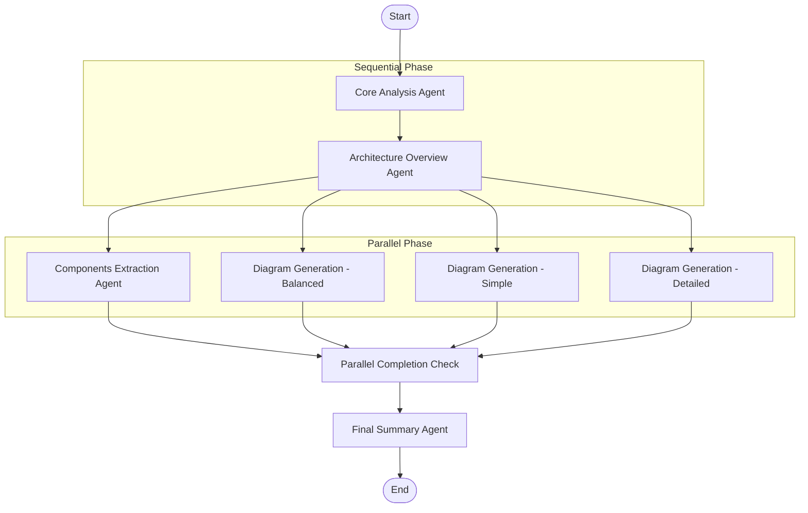
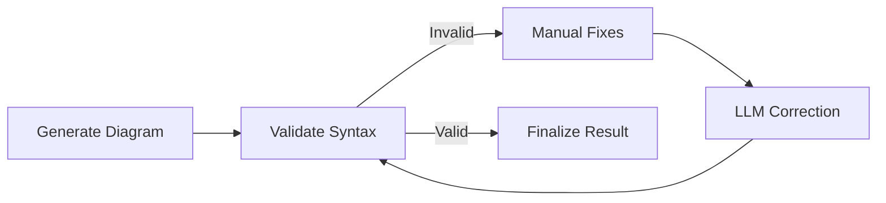
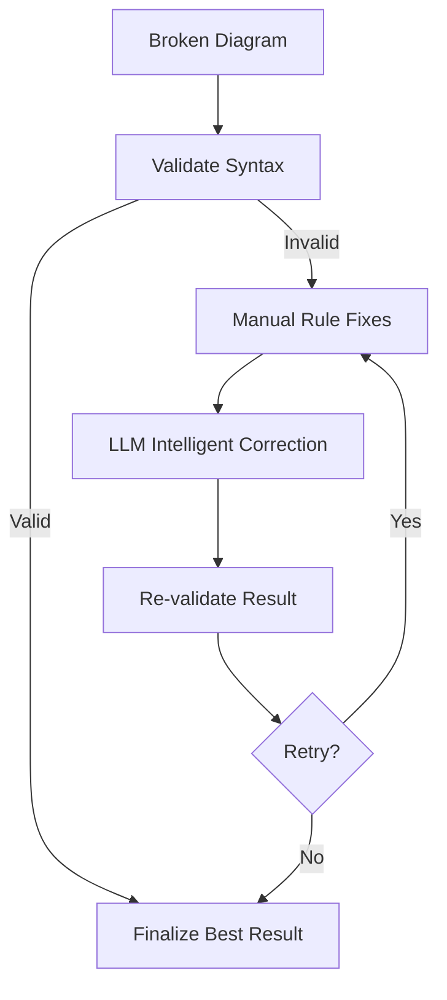

# LangGraph AI Agent Workflows

## Overview

Code Architecture Mapper uses **Microsoft's LangGraph** to implement sophisticated AI agent workflows. This creates a system where multiple specialized agents work together to analyze code repositories with self-correction and intelligent decision-making capabilities.

## Why LangGraph?

LangGraph provides several key advantages for our use case:

- **State Management**: TypedDict-based state shared between agents
- **Conditional Routing**: Intelligent decision-making between workflow paths  
- **Parallel Execution**: Multiple agents can run concurrently
- **Error Recovery**: Built-in retry and fallback mechanisms
- **Composable Workflows**: Subgraphs can be combined and reused
- **Visual Debugging**: Workflow state can be inspected at each step

## Main Analysis Workflow

### Workflow Architecture



### State Schema

```python
class AnalysisState(TypedDict):
    # Input data
    analysis_id: str
    repo_url: str
    force_refresh: bool
    
    # Core analysis results (Step 1)
    repository_info: Optional[Dict[str, Any]]
    file_infos: Optional[List[Dict[str, Any]]]
    dependency_analysis: Optional[Dict[str, Any]]
    
    # Architecture overview (Step 2)  
    architecture_markdown: Optional[str]
    
    # Parallel processing results (Step 3)
    components: Optional[List[Dict[str, Any]]]
    diagrams_balanced: Optional[Dict[str, str]]
    diagrams_simple: Optional[Dict[str, str]]
    diagrams_detailed: Optional[Dict[str, str]]
    
    # Final results (Step 4)
    final_summary: Optional[Dict[str, Any]]
    
    # Error handling
    errors: Annotated[List[str], operator.add]
    processing_status: str
```

## Agent Implementations

### 1. Core Analysis Agent

**File**: `/backend/workflows/nodes.py::core_analysis_node`

**Purpose**: Performs static analysis of the repository without LLM involvement.

**Process**:
1. Clone repository using Git
2. Scan for supported files (Python, JS, TS, JSX, TSX)
3. Extract dependencies using hybrid approach:
   - **Python**: Grimp + AST fallback
   - **JS/TS**: Tree-sitter + regex fallback
4. Build dependency graph using NetworkX
5. Calculate centrality metrics and complexity scores
6. Prepare data structures for LLM processing

**Key Features**:
- **Deterministic**: No AI involved, purely algorithmic
- **Hybrid Analysis**: Multiple parsing strategies for robustness
- **Error Recovery**: Graceful fallback when tools fail
- **Efficient**: Processes only supported file types

### 2. Architecture Overview Agent

**File**: `/backend/workflows/nodes.py::architecture_overview_node`

**Purpose**: Generate human-readable architecture documentation using AI.

**Process**:
1. Take top files from core analysis
2. Extract code excerpts for context
3. Use Google Gemini to generate markdown documentation
4. Focus on architecture patterns, design decisions, and component relationships

**LLM Integration**:
- **Model**: Gemini 1.5 Flash with fallbacks
- **Prompt Engineering**: Structured prompts for consistent output
- **Context Management**: Carefully selected file excerpts to stay within token limits

### 3. Components Extraction Agent

**File**: `/backend/workflows/nodes.py::components_extraction_node`

**Purpose**: Identify and categorize architectural components.

**Hybrid Approach**:
1. **Rule-based Detection**: Pattern matching for common component types
2. **LLM Enhancement**: AI analysis of complex components
3. **Validation**: Ensure component definitions are consistent

**Component Types Detected**:
- Controllers/Routers
- Services/Business Logic  
- Data Models/Entities
- Utilities/Helpers
- Configuration/Settings
- Templates/Views

### 4. Diagram Generation Agents (3 Modes)

**Files**: 
- `/backend/workflows/nodes.py::diagram_generation_balanced_node`
- `/backend/workflows/nodes.py::diagram_generation_simple_node`
- `/backend/workflows/nodes.py::diagram_generation_detailed_node`

**Purpose**: Create Mermaid diagrams with different levels of detail.

Each mode uses a **Diagram Subgraph** for self-correction:

#### Diagram Subgraph Workflow



**Self-Correction Features**:
- **Syntax Validation**: Python-based Mermaid syntax checking
- **Manual Fixes**: Regex-based corrections for common errors
- **LLM Correction**: AI-powered intelligent fixes for complex issues
- **Retry Logic**: Up to 3 attempts with progressive enhancement
- **Fallback Strategy**: Use best attempt if perfect correction fails

### 5. Diagram Correction Agent (Specialized Subgraph)

**File**: `/backend/workflows/correction_subgraph.py`

**Purpose**: Dedicated agent for correcting Mermaid diagram syntax errors.

**Correction Pipeline**:



**Correction Strategies**:

1. **Manual Rule-Based Fixes**:
   - Missing diagram headers (`graph LR`, `flowchart TD`)
   - Unbalanced subgraph blocks
   - Invalid identifier syntax (spaces in node IDs)
   - Parentheses in node labels causing parser errors

2. **LLM Intelligent Correction**:
   - Complex syntax errors
   - Invalid edge definitions  
   - Malformed node declarations
   - Context-aware fixes based on analysis data

3. **Validation System**:
   - Python-based syntax checking (no external Mermaid validation needed)
   - Comprehensive error detection and categorization
   - Warning vs error classification

## Advanced Features

### Parallel Agent Execution

The workflow design enables **true parallelism** for independent tasks:

```python
# Architecture Overview completes, then triggers all parallel agents
graph.add_edge("architecture_overview", "components_extraction")
graph.add_edge("architecture_overview", "diagram_generation_balanced")
graph.add_edge("architecture_overview", "diagram_generation_simple") 
graph.add_edge("architecture_overview", "diagram_generation_detailed")

# All parallel agents converge at completion check
graph.add_edge("components_extraction", "parallel_check")
graph.add_edge("diagram_generation_balanced", "parallel_check")
graph.add_edge("diagram_generation_simple", "parallel_check")
graph.add_edge("diagram_generation_detailed", "parallel_check")
```

### Error Handling and Recovery

Each agent implements comprehensive error handling:

```python
def core_analysis_node(state: AnalysisState) -> AnalysisState:
    try:
        # Main analysis logic
        results = orchestrator.perform_core_analysis(state['repo_url'])
        state.update(results)
        state["processing_status"] = "core_complete"
        
    except Exception as e:
        error_msg = f"Core analysis failed: {e}"
        logger.error(error_msg)
        state["errors"].append(error_msg)
        # Continue workflow with partial results
        
    return state
```

**Error Recovery Strategies**:
- **Graceful Degradation**: Continue workflow with partial results
- **Fallback Methods**: Use simpler approaches when advanced methods fail
- **Error Aggregation**: Collect all errors for final reporting
- **Status Tracking**: Clear processing status at each stage

### Progress Tracking Integration

Agents update database progress status for real-time frontend updates:

```python
def update_analysis_progress(analysis_id: str, progress_status: str):
    """Update analysis progress in database for real-time UI updates"""
    from backend.storage.dao import AnalysisDAO
    AnalysisDAO.update_analysis(db, analysis_id, {"progress_status": progress_status})

# Usage in agents
update_analysis_progress(state['analysis_id'], "Generating architecture overview...")
```

## Configuration and Customization

### Agent Behavior Configuration

**File**: `/backend/config.py`

```python
# Core analysis settings
TOP_FILES = 40                           # Number of files for LLM processing
COMPONENT_COUNT = 8                      # Components to extract per type

# LLM integration settings  
USE_LLM_FOR_DIAGRAMS = True             # Enable AI diagram generation
USE_LLM_FOR_DEPENDENCY_ANALYSIS = False  # Enhance dependencies with AI
GEMINI_MODEL = "gemini-1.5-flash"       # Primary model

# Workflow settings
MAX_DIAGRAM_ATTEMPTS = 3                 # Diagram correction retry limit
```

### Custom Agent Development

To add a new agent to the workflow:

1. **Define State Extensions** (if needed):
```python
class AnalysisState(TypedDict):
    # Add new fields
    custom_analysis: Optional[Dict[str, Any]]
```

2. **Implement Agent Node**:
```python
def custom_analysis_node(state: AnalysisState) -> AnalysisState:
    logger.info("🔍 Running custom analysis")
    try:
        # Your analysis logic here
        results = perform_custom_analysis(state["file_infos"])
        state["custom_analysis"] = results
        return state
    except Exception as e:
        state["errors"].append(f"Custom analysis failed: {e}")
        return state
```

3. **Add to Workflow Graph**:
```python
def create_analysis_graph() -> StateGraph:
    graph = StateGraph(AnalysisState)
    
    # Add your node
    graph.add_node("custom_analysis", custom_analysis_node)
    
    # Connect to workflow
    graph.add_edge("architecture_overview", "custom_analysis")
    graph.add_edge("custom_analysis", "parallel_check")
    
    return graph.compile()
```

## Performance Characteristics

### Execution Time Analysis

**Typical Analysis Timeline** (for medium repository ~50 files):

- **Core Analysis**: 10-30 seconds (deterministic, local processing)
- **Architecture Overview**: 5-15 seconds (single LLM call)  
- **Parallel Phase**: 20-60 seconds (3 diagram modes + components, concurrent)
- **Final Summary**: 1-3 seconds (data aggregation)

**Total**: ~1-2 minutes with parallelization vs ~3-4 minutes sequential

### Resource Usage

- **Memory**: Peak ~200-500MB during analysis (temporary repository clone)
- **CPU**: Intensive during static analysis phase, moderate during LLM phases
- **Network**: Minimal except for LLM API calls and git operations
- **Storage**: Temporary (~10-50MB per analysis, cleaned up automatically)

### Scalability Considerations

- **Stateless Agents**: Each workflow instance is independent
- **Parallel Execution**: Natural horizontal scaling opportunity
- **Database Concurrency**: PostgreSQL handles multiple concurrent analyses
- **LLM Rate Limits**: Built-in quota management and retry logic

## Debugging and Monitoring

### Workflow Visualization

LangGraph provides built-in visualization for debugging:

```python
# Generate workflow diagram
graph = create_analysis_graph()
graph.draw_mermaid()  # Outputs Mermaid diagram of workflow
```

### State Inspection

Access complete state at any workflow step:

```python
# Run with state inspection
final_state = workflow.invoke(initial_state)

# Inspect intermediate results
print(f"Core Analysis: {final_state['processing_status']}")
print(f"Errors: {final_state['errors']}")
print(f"Components Found: {len(final_state.get('components', []))}")
```

### Logging and Telemetry

Comprehensive logging throughout the workflow:

```python
logger.info(f"🔄 Starting LangGraph analysis for {repo_url}")
logger.info(f"✅ Core analysis completed - {len(file_infos)} files found")
logger.warning(f"⚠️ Component extraction failed: {error_msg}")
logger.error(f"❌ LangGraph analysis failed: {exception}")
```

---

*This multi-agent architecture represents a significant advancement in automated code analysis, combining the reliability of static analysis with the intelligence of modern LLMs.*
