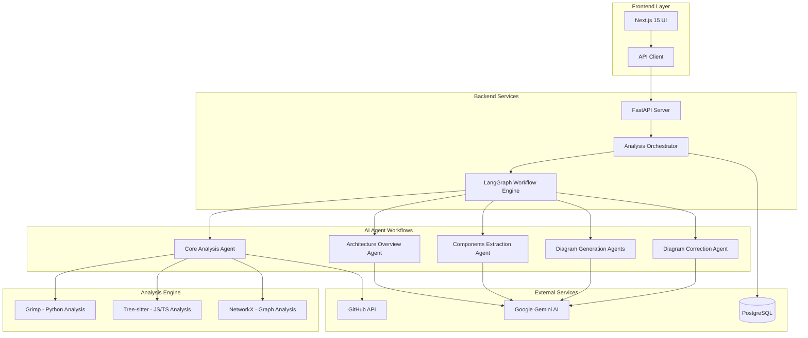

# Architecture Overview

## System Design Philosophy

Code Architecture Mapper (CAM) is built with a **multi-agent AI architecture** that combines deterministic static analysis with intelligent LLM-powered insights. The system uses **LangGraph** to orchestrate sophisticated workflows that can self-correct and adapt.

## High-Level Architecture



## Core Components

### 1. Frontend Application (Next.js 15 + TypeScript)

**Location**: `/frontend/`

- **Framework**: Next.js 15 with App Router
- **Language**: TypeScript
- **Styling**: Tailwind CSS
- **State Management**: React hooks with polling
- **Key Features**:
  - Real-time analysis progress tracking
  - Interactive Mermaid diagram rendering
  - Tabbed interface (Overview, Components, Diagrams, Files)
  - Comprehensive error handling with user-friendly messages
  - Example repository showcase

### 2. Backend API Server (Python FastAPI)

**Location**: `/backend/`

- **Framework**: FastAPI with automatic OpenAPI documentation
- **Language**: Python 3.11+
- **Database**: PostgreSQL with SQLAlchemy ORM
- **Key Features**:
  - RESTful API with async/await patterns
  - Automatic request/response validation
  - CORS configuration for frontend integration
  - Health checks and monitoring endpoints

### 3. LangGraph Workflow Engine

**Location**: `/backend/workflows/`

The heart of the AI agent system, implementing sophisticated multi-step analysis workflows:

#### Main Analysis Workflow (`graph.py`)
```
START → Core Analysis → Architecture Overview → [Parallel Processing] → Final Summary → END
                                                 ↓
                                    Components Extraction
                                    Diagram Generation (Balanced)
                                    Diagram Generation (Simple) 
                                    Diagram Generation (Detailed)
```

#### Diagram Correction Subgraph (`correction_subgraph.py`)
```
Validate → Manual Fixes → LLM Correction → Re-validate → Retry/Finalize
    ↑                                          ↓
    ←─────── Retry Loop (max 3 attempts) ──────
```

### 4. Hybrid Code Analysis Engine

**Location**: `/backend/services/analysis/`

#### Enhanced Architecture Mapper (`archmap_enhanced.py`)
- **Python Analysis**: Grimp for accurate import resolution and package detection
- **JS/TS Analysis**: Tree-sitter for AST-based parsing with tsconfig.json support
- **Fallback Strategy**: AST/regex parsing when advanced tools fail
- **Graph Analysis**: NetworkX for centrality metrics and dependency visualization

#### Key Capabilities:
- **Multi-language Support**: Python, JavaScript, TypeScript, JSX, TSX
- **Dependency Resolution**: Internal vs external dependency classification  
- **Metrics Calculation**: Fan-in, fan-out, degree centrality, complexity scores
- **Smart Categorization**: External dependencies grouped by type (frameworks, utilities, etc.)

### 5. AI Integration Layer

**Location**: `/backend/llm/`

#### Google Gemini Integration (`gemini.py`)
- **Multi-Model Support**: Gemini 1.5 Flash with fallback models
- **Quota Management**: Intelligent handling of rate limits and quotas
- **Response Processing**: Clean JSON/Markdown extraction with validation
- **Error Recovery**: Automatic retries with exponential backoff

#### Content Generation Services (`content_generation.py`)
- **Architecture Documentation**: AI-generated repository overviews
- **Component Extraction**: Rule-based + LLM hybrid component analysis
- **Diagram Generation**: Intelligent Mermaid diagram creation
- **Diagram Correction**: Self-correcting syntax validation and fixes

### 6. Data Persistence Layer

**Location**: `/backend/database/` and `/backend/storage/`

#### Database Schema
- **Analyses Table**: Main analysis results and metadata
- **Files Table**: Individual file metrics and centrality data
- **Examples Table**: Pre-computed example repositories

#### Caching Strategy
- **Analysis Caching**: Avoid re-analyzing unchanged repositories
- **Example Fixtures**: Pre-computed results for demonstration
- **Smart Invalidation**: Force refresh option for updated repositories

## Key Design Patterns

### 1. Multi-Agent Orchestration
- **Separation of Concerns**: Each agent handles a specific analysis aspect
- **Parallel Processing**: Independent agents run concurrently where possible
- **State Management**: Shared state between agents with LangGraph TypedDict

### 2. Self-Correcting Systems
- **Validation First**: All outputs validated before acceptance
- **Progressive Correction**: Manual rules → LLM intelligence → Best effort
- **Retry Logic**: Configurable attempts with intelligent backoff

### 3. Hybrid Analysis Approach
- **Tool Specialization**: Best tool for each language/task
- **Graceful Degradation**: Fallback methods when preferred tools fail
- **Result Fusion**: Combine results from multiple analysis methods

### 4. Production-Ready Deployment
- **Container-First**: Docker containers for consistent deployment
- **Environment Separation**: Development, staging, production configurations
- **Health Monitoring**: Comprehensive health checks and logging
- **Scalable Architecture**: Stateless services with external data persistence

## Technology Stack

### Backend
- **FastAPI 0.111.0** - Modern async web framework
- **LangGraph** - Microsoft's agent workflow framework  
- **SQLAlchemy 2.0.23** - Modern Python ORM
- **PostgreSQL** - Robust relational database
- **Grimp** - Python import graph analysis
- **Tree-sitter** - Universal syntax tree parsing
- **NetworkX 3.3** - Graph analysis and algorithms
- **Google Generative AI 0.7.2** - Gemini LLM integration

### Frontend  
- **Next.js 15** - React framework with App Router
- **TypeScript** - Type-safe JavaScript
- **Tailwind CSS** - Utility-first styling
- **Mermaid** - Diagram rendering
- **React Markdown** - Markdown content display
- **Lucide React** - Modern icon system

### Infrastructure
- **Docker** - Containerization
- **PostgreSQL** - Primary database
- **Vercel** - Frontend deployment (recommended)
- **Render** - Backend deployment (recommended)
- **GitHub Actions** - CI/CD pipeline support

## Scalability Considerations

### Horizontal Scaling
- **Stateless Services**: All application state in database/external services
- **Connection Pooling**: PostgreSQL connection management
- **Caching Strategy**: Redis integration ready for session/result caching

### Performance Optimization
- **Parallel Processing**: LangGraph enables concurrent agent execution
- **Smart Caching**: Avoid re-analyzing unchanged repositories
- **Streaming Responses**: Real-time progress updates via polling
- **Lazy Loading**: Frontend components load data on demand

### Resource Management
- **Memory Efficient**: Repository clones cleaned up after analysis
- **LLM Quota Management**: Intelligent API usage with fallbacks
- **Database Indexing**: Optimized queries for large datasets
- **Error Recovery**: Graceful handling of partial failures

---

*For detailed implementation guides, see the specific documentation in each subdirectory.*
